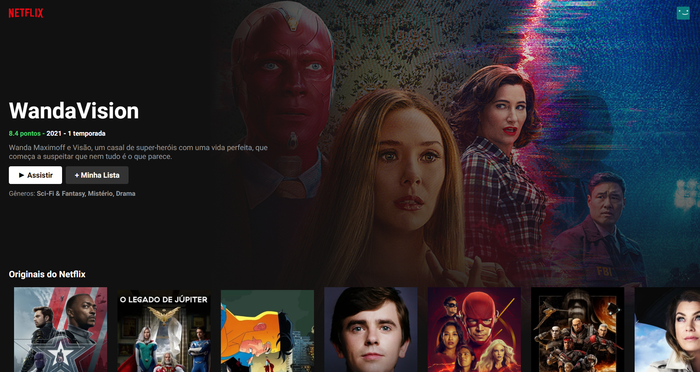
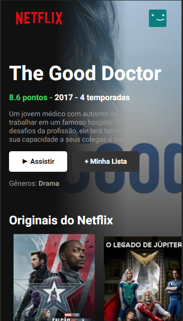
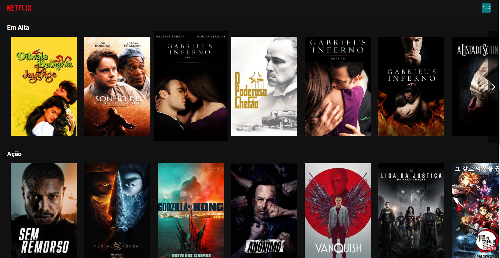

# Clone ui for study react

Data got from https://api.themoviedb.org/3
Live at: https://leolikestocode.github.io/react-netflix-clone-ui/

## Images

### Desktop 1

### Mobile 1

 

### Desktop 2

